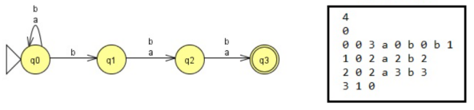

# NFA
A nondeterministic finite automaton (NFA), or nondeterministic finite-state machine, does not need to obey these restrictions. In particular every DFA is also an NFA. check out this [link](https://campusingenieriaytecnologia.ull.es/pluginfile.php/344980/mod_assign/introattachment/0/p09_dfa2G.pdf)
## Requisites
An NFA is represented formally by a 5-tuple, {Σ, Q, Δ, q0, F, δ}, consisting of:
* a finite set of states Q.
* a finite set of input symbols Σ .
* a transition function Δ : Q x Σ => P(Q).
* an initial (or start) state q0 ϵ Q.
* a set of states F distinguished as accepting (or final) states F ⊆ Q.
## NFA Configuration file
'''
4 // Q
0 // q0
// ACTUAL STATE, IS FINAL STATE, NUM TRANSITIONS, TRANSITION {STIMULATION, STATE ...} 
0 0 3 a 0 b 0 b 1  
1 0 2 a 2 b 2
2 0 2 a 3 b 3
3 1 0
'''
An example:

